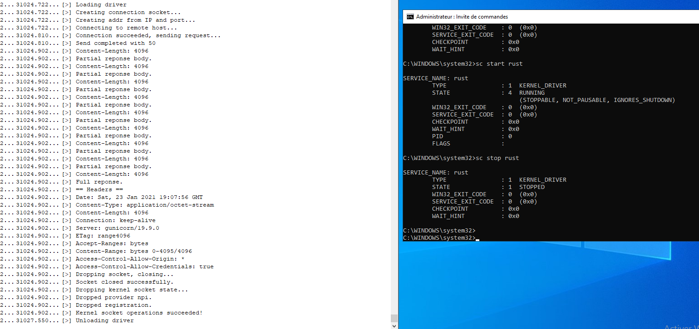

# Introduction

This library is derived from https://github.com/not-matthias/kernel-driver-with-rust.
You can also check https://not-matthias.github.io/kernel-driver-with-rust/.

I am not a rust expert nor I am a windows kernel expert, don't expect high quality.
This is just a toy project.

# Packages

- `windows-kernel-common-sys` library is providing kernel types (`ntifs.h` and its transitive dependencies).
- `windows-kernel-ntoskrnl-sys` is providing (a lot of) kernel functions (`ntfis.h` and its transitive dependencies).
- `windows-kernel-cng-sys` is providing [BCrypt](https://docs.microsoft.com/en-us/windows/win32/api/bcrypt/) bindings.
- `windows-kernel-netio-sys` is providing [Winsock](https://docs.microsoft.com/en-us/windows-hardware/drivers/ddi/wsk/) bindings.
- `windows-kernel-winsock` is a high level wrapper of [Winsock], providing rust abstractions over the raw api.

- `windows-kernel-winsock-example` is a kernel driver that use the `winsock` library to call [httpbin](http://httpbin.org/#/Dynamic_data/get_range__numbytes_).

# Building and running the winsock example

## Prerequisite

Every package should be available through with the `Visual Studio Installer`

- Microsoft Visual Studio
- [Windows Driver Kit](https://docs.microsoft.com/en-us/windows-hardware/drivers/download-the-wdk)
- LLVM (clang)
- cargo (and [cargo-make](https://github.com/sagiegurari/cargo-make#installation))

## Compiling

- `cd windows-kernel-winsock-example`
- `cargo make sign`

The command should generate a signed driver, located under `target\x86_64-pc-windows-msvc\debug\windows_kernel_winsock_example.sys`.

## Running

Go in your win10 VM.
Open [Dbgview](https://docs.microsoft.com/en-us/sysinternals/downloads/debugview) and enable kernel logging.
Open a terminal as admin.

- *if not already existing* `sc create windows_kernel_winsock_example binPath="absolute path to windows_kernel_winsock_example.sys" type=kernel`
- `sc start windows_kernel_winsock_example`
- `sc stop windows_kernel_winsock_example`

The driver should produce something like:

